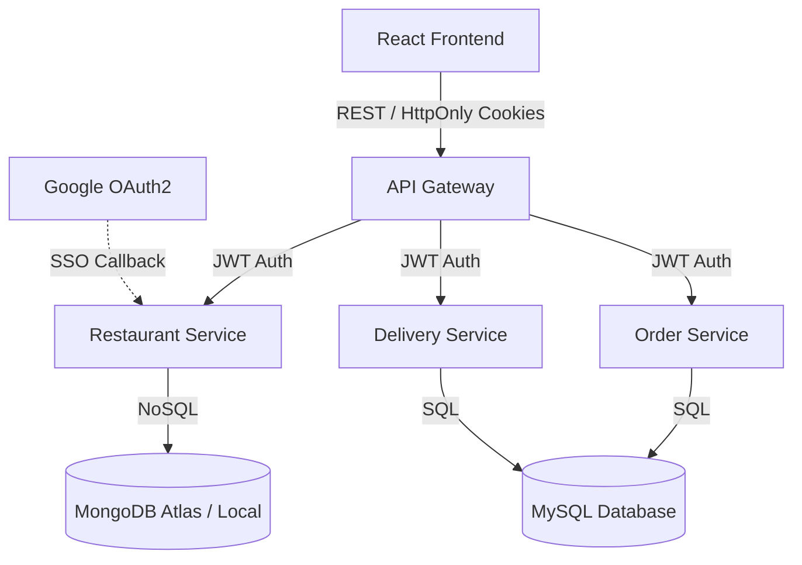

# SE4030 Secure Software Development - Assignment

**Group Members Details**

| Name | Index Number | Assigned Role / Service |
| :--- | :--- | :--- |
| Gunasena R.K.R.M.S.K. | IT22125798 | API Security Lead |
| Kaushalya P.L.P.D. | IT22220424 | Restaurant Service |
| Jayasinghe Y.L. | IT22293930 | Order Service |
| Perera K.D.N. | IT22070630 | Delivery Service |

**Original Repository:** [https://github.com/sasmithaK/hands-on-microservices](https://github.com/sasmithaK/hands-on-microservices)

**Fixed Repository:** [https://github.com/sasmithaK/SE4030-ssd-assignment](https://github.com/sasmithaK/SE4030-ssd-assignment)

**YouTube Demo Video:** https://youtu.be/[video-id]

## Project Overview
This repository contains a full-stack **Food Delivery System** built with a Spring Boot Microservices architecture (Restaurant, Order, and Delivery services) and a React frontend. The application uses MySQL and MongoDB for data persistence and routes API traffic through a Spring Cloud API Gateway.

### High-Level System Architecture

The project follows a distributed microservices pattern:

1. **Frontend Layer:** A React-based web application communicating with the backend via REST APIs.
2. **API Gateway:** Centralized routing and load balancing for incoming client requests.
3. **Microservices Layer:**
   * **Restaurant Service (Port 8082):** Handles menus, restaurants, and user authentication (including Google OAuth2 flow). Uses **MongoDB** for flexible document storage.
   * **Order Service (Port 8083):** Manages customer orders and checkout processes. Uses a relational **MySQL** database.
   * **Delivery Service (Port 8084):** Manages driver registrations, profiles, and deliveries. Uses a relational **MySQL** database.
4. **Security Layer:** Stateless JWT tokens for intra-service authentication, hardened with `HttpOnly` cookies and Google OAuth2 for administration endpoints.

## Assignment Goal (SE4030)
The objective of this assignment is to identify and remediate security vulnerabilities in an existing application. In this project, we:
1. Conducted SAST and DAST security audits using tools like OWASP ZAP, SonarQube, and TruffleHog.
2. Identified **9 distinct vulnerabilities** across 6 OWASP Top 10 categories (exceeding the requirement of 7).
3. Successfully patched all vulnerabilities in the source code.
4. Implemented a mandatory **OAuth2 / OpenID Connect** feature by securing the Restaurant Admin login portal via Google OAuth2 with secure HttpOnly cookies.

