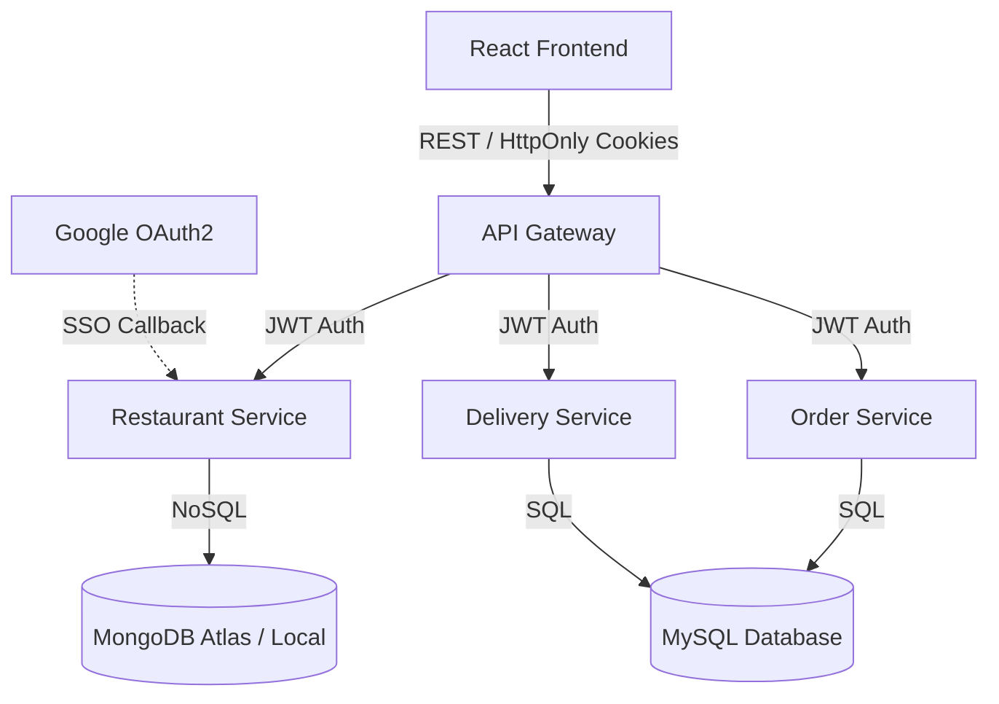

# SE4030 Secure Software Development - Assignment

**Group Members Details**

| Name | Index Number | Assigned Role / Service |
| :--- | :--- | :--- |
| Gunasena R.K.R.M.S.K. | IT22125798 | API Security Lead |
| Kaushalya P.L.P.D. | IT22220424 | Restaurant Service |
| Jayasinghe Y.L. | IT22293930 | Order Service |
| Perera K.D.N. | IT22070630 | Delivery Service |

**Original Repository:** [https://github.com/sasmithaK/hands-on-microservices](https://github.com/sasmithaK/hands-on-microservices)

**Fixed Repository:** [https://github.com/sasmithaK/SE4030-ssd-assignment](https://github.com/sasmithaK/SE4030-ssd-assignment)

**YouTube Demo Video:** https://youtu.be/[video-id]

## Project Overview
This repository contains a full-stack **Food Delivery System** built with a Spring Boot Microservices architecture (Restaurant, Order, and Delivery services) and a React frontend. The application uses MySQL and MongoDB for data persistence and routes API traffic through a Spring Cloud API Gateway.

### High-Level System Architecture

The project follows a distributed microservices pattern:

1. **Frontend Layer:** A React-based web application communicating with the backend via REST APIs.
2. **API Gateway:** Centralized routing and load balancing for incoming client requests.
3. **Microservices Layer:**
   * **Restaurant Service (Port 8082):** Handles menus, restaurants, and user authentication (including Google OAuth2 flow). Uses **MongoDB** for flexible document storage.
   * **Order Service (Port 8083):** Manages customer orders and checkout processes. Uses a relational **MySQL** database.
   * **Delivery Service (Port 8084):** Manages driver registrations, profiles, and deliveries. Uses a relational **MySQL** database.
4. **Security Layer:** Stateless JWT tokens for intra-service authentication, hardened with `HttpOnly` cookies and Google OAuth2 for administration endpoints.

## Assignment Goal (SE4030)
The objective of this assignment is to identify and remediate security vulnerabilities in an existing application. In this project, we:
1. Conducted SAST and DAST security audits using tools like OWASP ZAP, SonarQube, and TruffleHog.
2. Identified **9 distinct vulnerabilities** across 6 OWASP Top 10 categories (exceeding the requirement of 7).
3. Successfully patched all vulnerabilities in the source code.
4. Implemented a mandatory **OAuth2 / OpenID Connect** feature by securing the Restaurant Admin login portal via Google OAuth2 with secure HttpOnly cookies.

## Tools Used for Security Auditing
We utilized a combination of dynamic analysis (DAST), static analysis (SAST), and AI-driven code reviews to thoroughly audit the application:
* **OWASP ZAP:** Used for dynamic application security testing (DAST), intercepting API requests, and fuzzing payloads to uncover broken access control and injection flaws.
* **GitHub Code Scanning (CodeQL):** Leveraged for static application security testing (SAST) to detect issues like Browser Storage Poisoning and configuration weaknesses.
* **SonarQube Cloud:** Used for continuous inspection of code quality, detecting hardcoded secrets, and flagging insecure security configurations (e.g., disabled CSRF).
* **CodeRabbit AI:** Utilized for AI-powered pull request reviews to catch logic flaws, review security patches, and ensure secure coding best practices during merges.
* **TruffleHog:** Scanned the Git commit history to unearth hidden secrets and leaked database credentials.

---

## Part 1: Vulnerability Findings and Fixes

### V1: Hardcoded JWT Secret Key (A02: Cryptographic Failures)
* **Identification Tool:** SonarQube (SAST) / Manual Git Log
* **Vulnerability:** The JWT signing key was hardcoded in plain text in JwtUtils.java, allowing anyone to forge valid admin tokens.
* **Fix:** Removed the hardcoded string and injected the secret via environment variables (`@Value("${jwt.secret}")`).

### V2: Exposed MongoDB Credentials (A02: Cryptographic Failures)
* **Identification Tool:** TruffleHog (Secret Scanner)
* **Vulnerability:** Live MongoDB Atlas connection string (with username and password) was hardcoded in application.properties.
* **Fix:** Replaced the hardcoded URI with the `SPRING_DATA_MONGODB_URI` environment variable.

### V3: Plaintext Passwords in Database (A02: Cryptographic Failures)
* **Identification Tool:** Manual Database Inspection (MySQL Query)
* **Vulnerability:** Customer passwords were being stored in the database without any encryption or hashing.
* **Fix:** Implemented `BCryptPasswordEncoder` to hash passwords before saving them, and used `.matches()` for secure login verification.

### V4: Broken Access Control (A01: Broken Access Control)
* **Identification Tool:** OWASP ZAP (DAST) - Active Scan / Spider
* **Vulnerability:** Admin endpoints in the Restaurant Service lacked role-based access checks, allowing any regular customer to access admin APIs.
* **Fix:** Enabled `@EnableMethodSecurity` and added `@PreAuthorize("hasRole('RESTAURANT_ADMIN')")` to all admin endpoints.

### V5: CORS Wildcard and IDOR (A01: Broken Access Control / A05: Security Misconfiguration)
* **Identification Tool:** Browser DevTools / OWASP ZAP
* **Vulnerability:** The Delivery Service had a wildcard CORS and lacked ownership checks, allowing any user to update another driver's profile.
* **Fix:** Removed the wildcard CORS and added explicit validation using `SecurityContextHolder` to ensure the logged-in email matches the profile being edited.

### V6: Missing Input Validation (A03: Injection)
* **Identification Tool:** OWASP ZAP (Fuzzing / Active Scan)
* **Vulnerability:** DTOs lacked bean validation, allowing empty or malformed data to reach the database and potentially cause NoSQL/SQL injection.
* **Fix:** Added `@Valid`, `@NotBlank`, and `@Size` annotations to all DTOs and Controller endpoints across all services.

### V7: Sensitive Data in API Responses and LocalStorage (A02 / A07)
* **Identification Tool:** OWASP ZAP / CodeQL (Browser Storage Poisoning)
* **Vulnerability:** The API returned raw passwords in JSON responses, and frontend clients stored sensitive JWTs and user data in localStorage (vulnerable to XSS).
* **Fix:** Excluded passwords from DTO responses. Relocated JWT storage from localStorage to secure, `HttpOnly` cookies.

### V8: Unauthenticated MongoDB Exposed on Public Port (A05: Security Misconfiguration)
* **Identification Tool:** mongosh / Nmap
* **Vulnerability:** The MongoDB container in docker-compose.yaml had no root username/password set and exposed port 27017 directly to the host.
* **Fix:** Added `MONGO_INITDB_ROOT_USERNAME` and `PASSWORD` environment variables to enforce database authentication.

### V9: Insufficient Security Logging (A09: Security Logging Failures)
* **Identification Tool:** Manual Code Review / SonarQube
* **Vulnerability:** Missing structured logging for security events (login failures, etc.), and sensitive financial transactions were printed using `System.out.println()`.
* **Fix:** Replaced standard output with `@Slf4j` secure logging (`log.info()`, `log.warn()`) across all relevant service controllers and global exception handlers.

---

